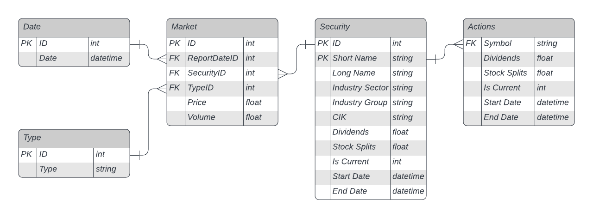
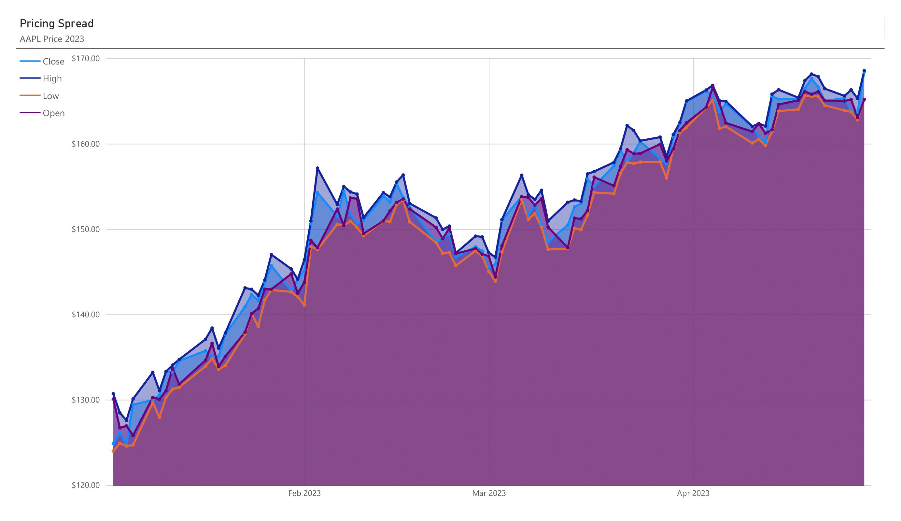

# S&P 500 Analysis
| Current Relational Model |
|:--:|
||
|'Market' table references other tables via foreign keys|
 
### BI Reports
| Historical Pricing Data for 2023 |
|:--:|
||
|Displays open/close and high/low pricing data for top tech companies|

| AAPL Pricing Spread for 2023 |
|:--:|
||
|Displays open/close and high/low pricing data for Apple Inc.
 Calculated spread can be found [HERE](Reports/AAPL Pricing Spread.csv)|

### Disclaimer
Current data source limited to yfinance API. Will look to incorporate more APIs as development advances.
